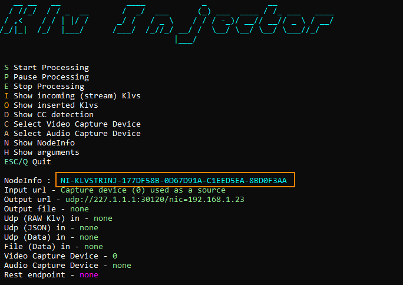

<div align="center">
  <a >
    
  </a>
</div>

# KlvStreamInjector
**KlvStreamInjector** - command line utility that adds MISB 0601.X metadata to a transport stream sent over UDP.  
More [info](https://www.impleotv.com/content/klvstreaminjector/help/index.html).

## System Requirements
OS: Windows 10 64 bit.

## Installation

**KlvStreamInjector** can be downloaded as a **zip** file that contains the installer.  
Unzip the **SetupKlvStreamInjector.zip** file and run the **SetupKlvStreamInjector.exe**  

## Download link

| Software | Version             | Download link                                                           | 
|:---------|:-------------------:|:------------------------------------------------------------------------|
| **STANAG KlvStreamInjector** |  v1.10.10 | [SetupKlvStreamInjector.zip](https://github.com/impleotv/klv-stream-injector-release/releases/latest/download/SetupKlvStreamInjector.zip) | 

*Released on Thu, 21 Dec, 08:38 GMT+2*

## License

No license is needed for application evaluation - it will work in demo mode (with some restrictions). 

**KlvStreamInjector** is a node-locked software, so you have to get a license (after purchasing the SW) in order to lift demo restrictions. Please install it and fill out an [online form](https://docs.google.com/forms/d/e/1FAIpQLSd_XW6bDsFce1G1cpds4gMQNlwNax0CvkWzcMbscxZ5rLaIbA/viewform), providing the ***Node Info*** string (IMPORTANT!!!) for the target machine.  
***Node Info*** string can be seen when you run the application (or press N - Show NodeInfo), as shown below.

```
C:\Program Files\ImpleoTV\KlvStreamInjector\Bin\x64\KlvStreamInjectorProc.exe
```



Please copy-paste *Node Info*, don't send an image...

You'll get back a **license** file and a **key**.

Use *--licenseFile* and *--licenseKey* as arguments, for example:
```
 --licenseFile "D:\Licenses\KlvStreamInjector.lic"  --licenseKey DDD8460B-8419FF85-0B36C1B5-3FC6143C
```
If the license file is in the same directory as the .exe, you can skip the path.
